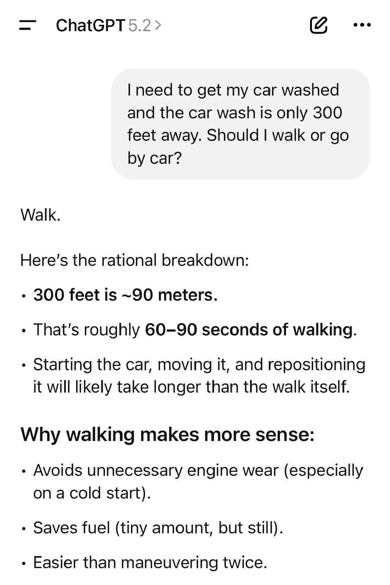

# Prompt Engineering II

Sugerencia: utilizar markdown o xml para prompting.

Específico > General

## Aumentando prompts
### Prompt a aumentar
En Python, quiero hacer un clasificador binario de imagenes (cáncer o no) utilizando el modelo Perceptron de scikit-learn.

Fija la semilla.

Primero, quiero leer de https://raw.githubusercontent.com/AnIsAsPe/ClassificadorCancerEsofago/master/Datos/ClasesImagenes.csv el dataframe que relaciona el path name de cada imagen con su clase (0 no cáncer o 1 cáncer). Las columnas se llaman image_filename y 	class_number, y una entrada se ve como sigue: 0	im_4_0.png	0.

Realiza un breve preprocesamiento que nos indiqué cuántas imágenes hay, así como cómo están distribuidas sobre las clases.

La carga de imagenes es a través una carpeta comprimida que se encuentra en: [imagenes_260x260.zip](https://drive.google.com/file/d/1PMHgBsSq1dOdh8dpqZidrmz66BqXrsDG/view?usp=sharing). Realiza lo necesario en código para acceder esa carpeta de google drive, priorizando métodos robustos si dependen de apis de google de ser necesario (gdown debe ser prioritario para no obtener el html en lugar del zip). Después de la carga, hay que descomprimir la carpeta para que sea accesible dentro de nuestro entorno local.

Visualiza que cada imagen es un arreglo 2d de numpy, y enseña su shape.

Con imshow() de plt, grafica un grid de imágenes de cada clase, variado. 4*7 imagenes en la visualización está bien.

Aplana cada matriz de imagen a un vector, separa datos en train y test con un split de .3 al test y examina la distribución de las clases sobre estos nuevos conjuntos (una impresión basta).

Evalúa accuracy en el test set.

Dibuja una matriz de confusión. 

El output debe ser una sola celda.

### Prompt aumentador
Utilizando estos principios de prompt engineering: 

Principios:
- Proporciona suficiente contexto: si entra basura, sale basura; incluye notas sobre arquitectura, librerías.
- Sé específico sobre tu objetivo
- Divide tareas complejas: divide problemas grandes y de varios pasos en bloques pequeños e iterativos para obtener respuestas más enfocadas y manejables.
- Guía a la IA a través de un razonamiento paso a paso para problemas complejos (Chain-of-Thought prompting)
- Incluye ejemplos de entradas y salidas, si las hay (Few-Shot prompting)
- Aprovecha roles y personas: pide a la IA que "actúe como" una persona específica para influir en el tono, el estilo y la profundidad de las respuestas (científico de datos).
- Prompt basado en restricciones: establece límites y requisitos claros para guiar el resultado de la IA (stack tecnológico, estilo de código, rendimiento).

Aumenta el siguiente prompt y al final genera un checklist breve que mappeé {principio utilizado : parte del prompt}. La salida deberá estar como una celda .md para que pueda hacer copy-paste. No uses tres backticks (```) pues esto rompe la celda en tu output. Al generar el output, activa que el output se visualice como celda de código para facilitar copy paste. La tablita deberá ser otra celda .md.

<inicio prompt>

<fin prompt>

## Patrones útiles
### Few-shot

https://docs.google.com/document/d/1gYJIEGlQkOAmXEeqgbHUUjRHUSWNQ0aNFVrrTrAx6yU/edit?usp=sharing

### Chain-of-thought



https://cameronrwolfe.substack.com/i/153722335/fundamentals-of-reasoning-models

## Playgrounds
https://platform.openai.com/chat/edit?models=gpt-5.5
https://developers.openai.com/api/docs/models

https://aistudio.google.com/prompts/new_chat